## Monolithic vs Microservice Architecture

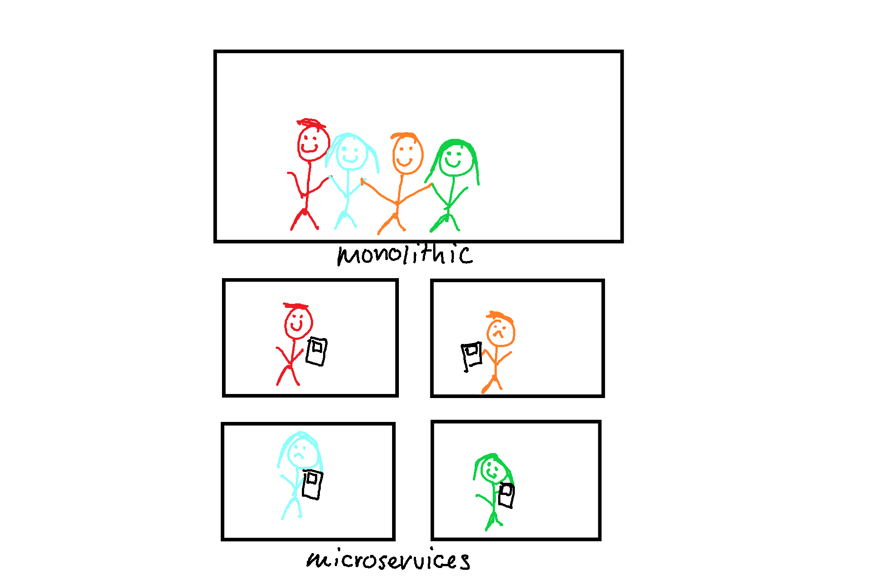

Imagine a family living in a single room where everyone shares the same space and resources. In this scenario, the family members rely on each other for various tasks and communicate directly. They have limited privacy and must coordinate their activities within the confined space.

**Monolithic Architecture Comparison:**

- In monolithic architecture, the entire application is developed as a single unit, similar to a family living in a shared room.
- All functionalities of the application are tightly integrated and interdependent, like how family members rely on each other within the limited space.
- Scaling the monolithic application can be challenging, just like accommodating a growing family within a small room.
- Changes or updates to one part of the application can affect the entire system, similar to how one action or decision in the room impacts the entire family.
- Debugging and troubleshooting can be difficult in monolithic architecture, as isolating and resolving issues may require considering the entire application as a whole, like managing activities in the shared family room.

**Microservices Architecture**

Now, let's consider a family living in individual rooms with separate spaces and resources. Each family member has their own room, allowing them privacy and independence. They can choose when to interact and collaborate with other family members.


**Microservices Architecture Comparison:**

- In microservices architecture, the application is divided into small, independent services, similar to family members living in separate rooms.
- Each service handles specific functionalities and operates independently, similar to family members having their own personal space.
- Services can be developed, deployed, and scaled independently, just like family members having the freedom to manage their own rooms.
- Changes or updates to one service have minimal impact on others, like family members having their autonomy within their individual spaces.
- Debugging and troubleshooting are easier in microservices architecture, as issues can be isolated to specific services, similar to resolving matters within individual rooms.

Microservices use synchronous **(RESTful, HTTP)** and asynchronous (Message Queue) protocols to communicate. They provide **flexibility in programming languages** and expose RESTful APIs for interaction. Monolithic Architecture scales by increasing the resources of the entire application **(vertical scaling)**, while Microservices Architecture scales by adding more instances of individual services based on demand **(horizontal scaling).**

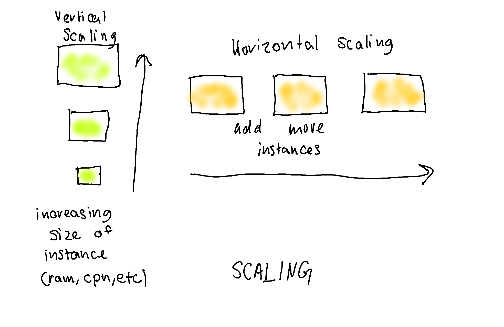

A monolithic program mostly runs on a single server, like a big house where everything is in one place. On the other hand, microservices applications work better in the cloud, which is like having different houses for different tasks. While microservices can run on a single server, developers usually choose to use cloud service providers to benefit from scalability, fault tolerance, and high availability. Before you can start using microservices, you need to set up the right tools and workflow. It requires more effort compared to monolithic programs, but it's worth it when building large and scalable applications.

**Microservices**

Old, large applications are now being divided into smaller parts called microservices. These microservices can work independently, making it easier to develop, **deploy, update, and scale** them as needed. This flexibility allows businesses to quickly adapt to changing requirements by making changes to specific components without affecting the entire system.

We got the microservices, what next how to and where to deploy?

For example let's consider VM:

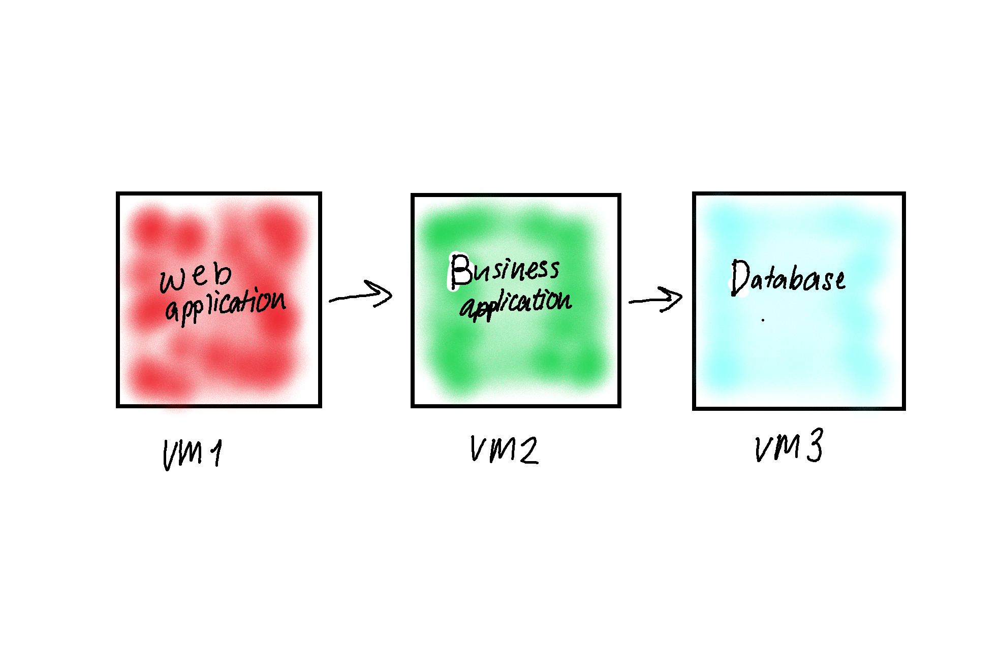

Microservices deployment on a VM using Web Application, Business Application, and a Database application:

Web Application:

- The web application hosts the user interface accessible through web browsers.
- It handles user requests and serves the frontend of the web application.
- The web application communicates with the business application for processing user inputs and retrieving data.

Business Application:

- The business application runs the core logic of the system.
- It dynamically scales based on demand to handle the workload effectively.
- The business application interacts with the data storage for accessing product information and customer orders.

Data Storage:

- The data storage component includes databases and other storage systems.
- It ensures high availability and scalability for efficient data management.
- The data storage component stores and retrieves product information, customer orders, and other relevant data.

In this example, the web application provides the user interface accessible through web browsers. The business application handles the core logic of the system and processes user inputs. The data storage component manages databases and storage systems for storing and accessing product information and customer orders.

Each component can be independently scaled based on demand, ensuring efficient resource allocation and fault tolerance. The microservices within each component communicate with each other using defined APIs or messaging protocols.

This microservices deployment allows for independent scaling and management of each application component, providing flexibility and efficient resource allocation for the web application, business application, and data storage.

**Container**

Things are going well, but now consider that the components have become **smaller and more numerous**. Assigning each one its own virtual machine (VM) has become impractical. Doing so would waste hardware resources and increase hardware expenses. Moreover, managing and configuring each VM individually would also impose a significant workload on system administrators, resulting in the inefficient use of human resources.

When faced with the challenges of managing numerous components without squandering hardware and human resources, people often turn to containers as an alternative solution. Containers let you run multiple services on one computer, giving each service its own separate environment. They also keep the services separate from each other, just like virtual machines (VMs), but without using as many resources.

## VM vs Container (Virtualization)

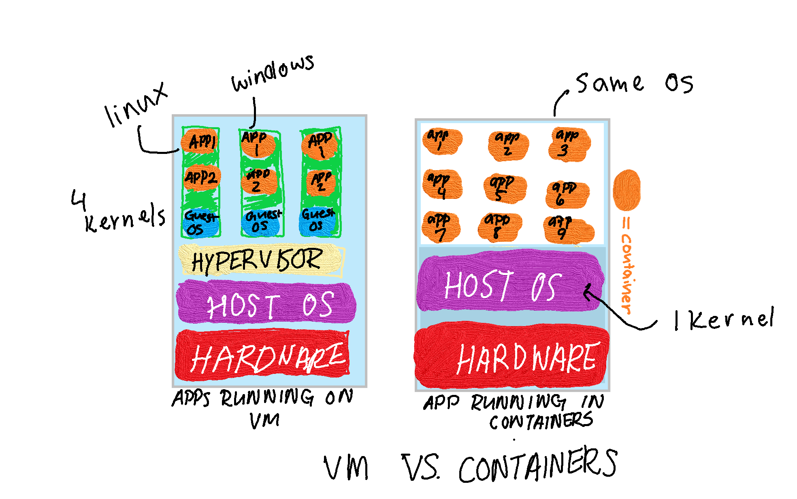

**Virtual Machines (VMs)**:

- Include the **guest operating system (OS)** and all application code and dependencies.
- VM images are typically larger in size, measured in **gigabytes**.
- Multiple VMs can run on a single physical server, even **with different operating systems**.
- VMs abstract servers from the underlying hardware and persist throughout their useful life.
- Suitable for **long-running applications** and workloads that require full isolation and multiple operating systems.

**Containers**:

- Share the **host OS** and include only the applications and their dependencies.
- Container images are generally smaller in size, measured in **megabytes**.
- Multiple containers running on a single server **share the same underlying OS**.
- Containers can be spun up and down quickly, often in milliseconds, making them efficient for ephemeral use cases with changing demand.
- Ideal for **microservices architecture** , scaling applications, and enabling rapid deployment and scalability.
- Since the underlying OS is shared, containers might not be as **safe** as virtual machines.


**Secret of multiple Containers**

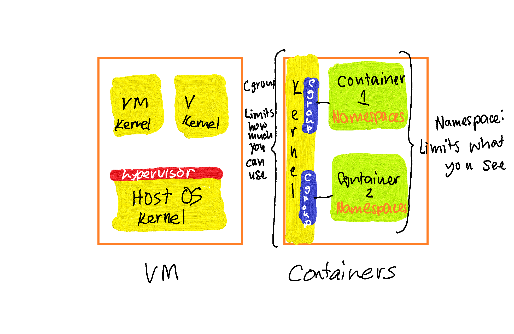

In a Linux system, there is a default **namespace** that includes all the system resources, like file systems, process IDs, user IDs, and network interfaces. This namespace is like a big container that holds everything together.Think of namespaces as separate rooms in a house. By default, you have one big room that contains everything. But with namespaces, you can create multiple rooms and organize things differently in each room.
**Namespaces** provide isolation of system resources, such as PIDs, network interfaces, and filesystems. This means that containers running in different namespaces cannot see or interact with each other's resources.

Here are some examples of namespaces:

- **Process ID (pid)**: This namespace provides separate process ID spaces for each namespace. Each room (namespace) has its own set of process IDs, so processes running in one room can't see or interfere with processes running in another room.
- **Mount (mnt)**: This namespace allows you to have different sets of file systems mounted in different namespaces. It's like having different storage spaces in different rooms of the house.
- **Network (net)**: This namespace gives you separate network interfaces for each namespace. It's like having separate sets of Wi-Fi routers in each room, so devices connected to one router can't directly communicate with devices connected to another router.

Another important aspect of container isolation is the control over system resource consumption. This control is achieved using **cgroups** , which is a feature provided by the Linux kernel. **Cgroups** allow you to set limits on how much system resources a process or a group of processes within a container can utilize. These resources can include CPU usage, memory allocation, network bandwidth, and more.

Cgroups, a Linux kernel feature, are like rules that allow you to limit the consumption of system resources by processes or groups of processes within containers. It's similar to how you set rules to limit the resources each room in a house can consume.

1. Cgroups Capabilities:
  - **Time Limit** : Just as you limit the time each room can use electricity, cgroups restrict the amount of CPU time that processes within a container can utilize.
  - **Consumption Cap** : Similar to setting a cap on the amount of water each room can consume, cgroups enable you to set memory limits for processes, preventing excessive memory usage within containers.
  - **Appliance Restriction** : Likewise, cgroups control the usage of network bandwidth, ensuring fair distribution of network resources among containers.
2. Fair Resource Distribution:
  - Equal Access: By implementing cgroups, you prevent a single process or container from monopolizing all the CPU time, memory, or network bandwidth, ensuring fair access to resources.
  - Resource Allocation: Cgroups set memory limits for processes within containers, preventing one container from excessively using memory and leaving insufficient resources for others.
  - Preventing Overload: With network bandwidth limits enforced by cgroups, containers share network resources fairly, avoiding network congestion caused by a single container using too much bandwidth.

Here is an analogy that might help to understand namespace and cgroups:
  - Containers are like rooms in a house.
  - Processes are like people in the house.
  - Cgroups are like the rules that you set for each room.
  - Namespaces are like the walls that separate the rooms.


## Docker

Docker is a powerful tool that has become closely associated with containers, but it's important to understand that Docker itself is **not a container.** Instead, Docker is a widely used developer tool and container engine that enables the creation, management, and deployment of containers.

Docker components and their roles in Docker.

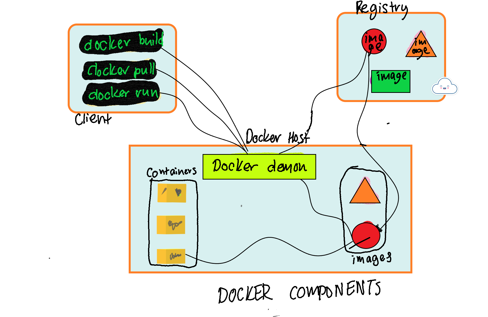

 **Docker Engine**: Docker Engine is the core component of Docker that provides the runtime environment for containers. When we install Docker on our system, we are essentially installing Docker Engine. Docker Engine consists of three main parts:
  - **Docker Client (docker CLI)**: The Docker Client is the command-line interface that allows users to interact with Docker. It sends commands and requests to the Docker Daemon (dockerd) for various container, network, image, and volume operations.
  - **Docker Daemon (dockerd)**: The Docker Daemon is the background service that runs on the host machine. It listens for commands from the Docker Client, communicates with various components, and manages the core Docker operations. It exposes a REST API that the Docker Client uses to communicate with it.
  - **REST API**: The REST API is the interface through which the Docker Client and Docker Daemon communicate. The Docker Client sends REST API requests to the Docker Daemon, specifying the desired actions, such as creating a container or managing network settings.

 **Containerd and runc**: While containerd is an important component in the Docker ecosystem, it is not directly responsible for creating or running containers. Instead, it acts as a container runtime that **manages the lifecycle of containers**. It interacts with the underlying operating system and leverages tools like **runc** for **container creation and execution.**
  - runc: runc is a lightweight command-line tool that serves as the container runtime for Docker. It is responsible for creating and running containers based on container specifications, such as the OCI (Open Container Initiative) runtime specification. runc interacts with the host OS to provide the necessary isolation and resource management for containers.
You can **run containers using runc**, but it is not as easy as using Docker or Podman. Runc is a low-level container runtime, while Docker and Podman are higher-level container management tools that provide a more user-friendly experience.

**Three main concepts in Docker**

- **Images**: Docker container images package applications and their environment, containing the filesystem and metadata. They can be run locally or stored in registries for sharing.
- **Registries**: Docker Registries store and share Docker images, allowing easy access and distribution across different computers. Public and private registries are available.
- **Containers**: Docker containers are isolated Linux processes created from Docker images. They run as separate processes, isolated from the host and other containers, with resource constraints allocated to them.

Docker images are like recipes for making different types of pizzas. Each image provides instructions and ingredients to create a specific pizza. Containers, on the other hand, are like individual servings of those pizzas. Once you follow the recipe (image) and create a pizza (container), you have a self-contained portion that you can enjoy, separate from other pizzas.

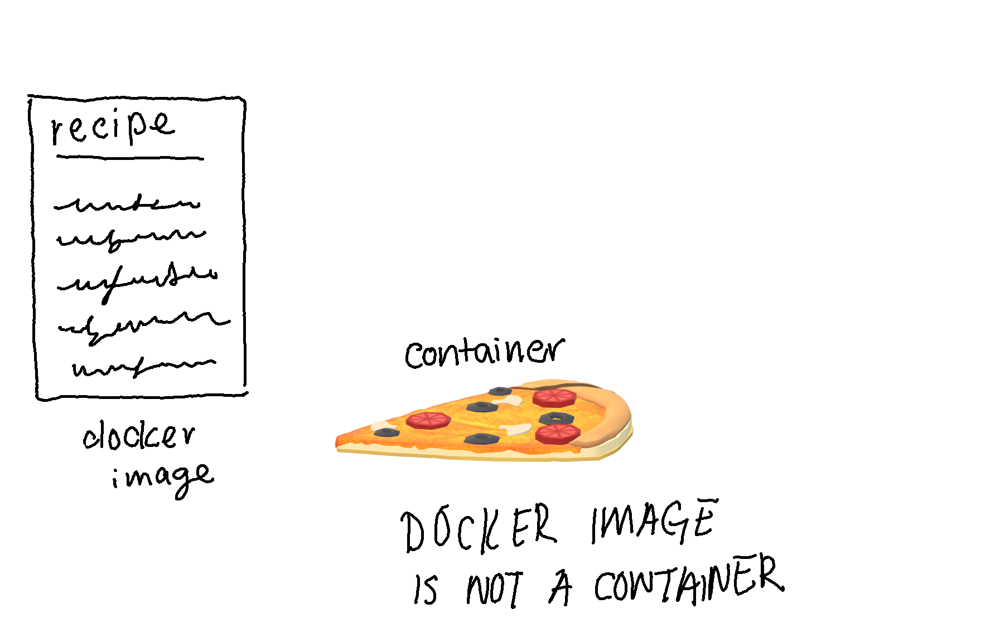
**Storage and Volume**

Container runtimes, such as Docker, provide the ability to store data within containers. When a container is stopped and then run again, the data stored within the container will persist. However, if the container is destroyed (removed), the data stored within it will also be destroyed.To achieve persistent data storage that survives container destruction, you can utilize host volumes. Host volumes allow you to mount directories or files from the host machine into the container, providing a way to store and access data that is independent of the container's lifecycle. The overlay2 driver is one of the available options for managing container filesystems and storage within Docker. It is a storage driver that utilizes the OverlayFS file system, which allows for efficient layered filesystems and copy-on-write operations.

Container images are built using a layered approach, where each layer represents a specific component or change in the image. These layers can be shared and reused across multiple images, resulting in more efficient use of storage and network resources. When running a container image, if some of its layers are already present on the local system from a previous image, only the missing layers need to be downloaded. **This minimizes the amount of data that needs to be transferred, speeds up image pulls, and reduces disk space usage by avoiding duplicate layers**.
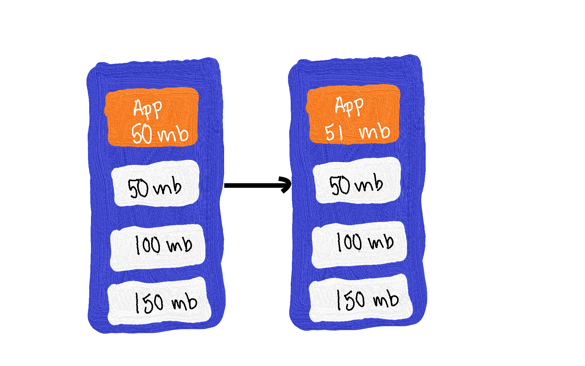
When you transfer a VM, you are transferring the entire virtual machine image, including the operating system, applications, and data. This means that if you make changes to the application or data on one VM, you will need to make the same changes on all of the other VMs that are using the same image.  example, the image is 350MB in size, and the application is 50MB. If you make a change to the application that is 1MB in size, you will need to create a new image that is 351MB in size. This is because the change to the application is not isolated from the rest of the image.
The container is 350MB in size, and the change to the application is 1MB in size. This means that you only need to transfer 1MB of data, instead of 350MB of data. This will make the transfer much faster.
The ability to pull only the changes that have been made to a container is due to Docker **Overlay filesystem**.
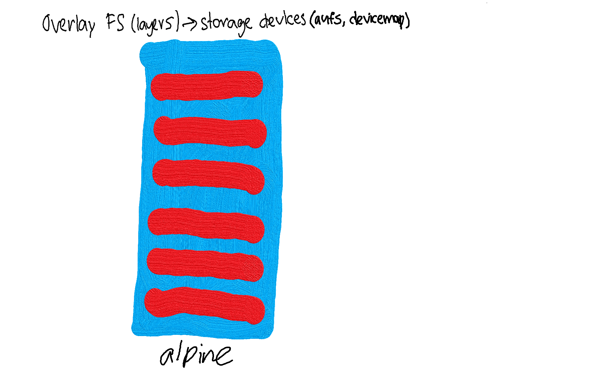
 Overlay filesystem is a type of filesystem that allows multiple layers to be stacked on top of each other. This allows containers to be layered, and each layer to contain the changes that have been made to the container since it was created.
 
 When you run a VM, the entire image is cloned and the clone is run. This can take a long time, especially if the image is large. When you run a container, the image is mounted as read-only. This means that the image is not cloned, and the container only has access to the read-only version of the image. This makes it much faster to start a container than to start a VM.
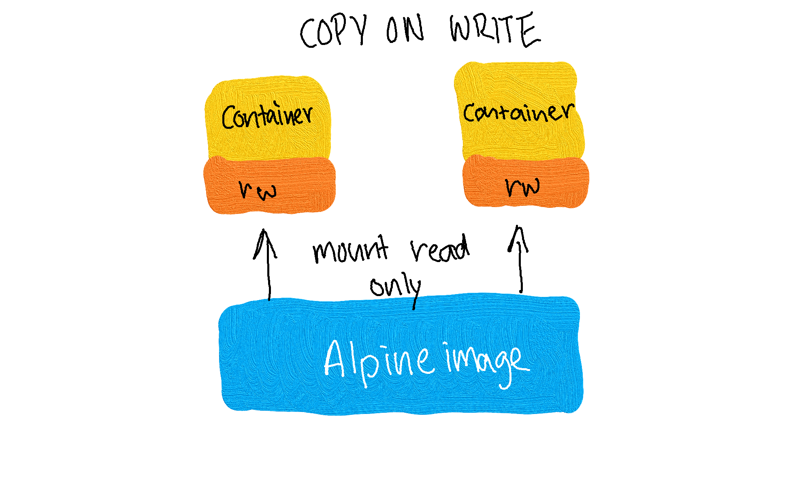

If you need to make changes to a container, you can use the **copy on write (COW)** feature. COW allows you to make changes to a container without having to clone the image. This is done by creating a new layer on top of the read-only image. The new layer is read-write, so you can make changes to it. When you stop the container, the changes are saved to the new layer.

This makes it very easy to make changes to containers. You can make changes to a container without having to start over from scratch. This is a major advantage of using containers over VMs.
You can use Docker Engine, Docker Desktop, or open-source alternatives like Podman. Each of these options provides containerization capabilities and allows you to build, run, and manage containers.

**Hands-on**

Let's jump into demo:

1. Image Management:
  - The default Docker registry is Docker Hub. Docker Hub is a public registry that hosts millions of Docker images. You can pull images from Docker Hub by using the docker pull command.
    ```sh
    docker pull
    ```
  - Listing downloaded images with 
    ```sh
    docker images
    ```
  - Removing unused images with 
   
    ```sh 
    docker rmi
    ```
  - Building custom images from a Dockerfile with 
    ```sh
    docker build
    ```
2. Pulling and Running a Container:
   ```sh
   docker pull <image_name> 
   docker run <image_name>
    ``` 
  - Example: Pull and run the official Nginx web server image: 
    ```sh
    docker pull nginx 
    docker run --name nigxserver -d -p 8080:80 nginx
    ```
    Note: Specify container ports ( **-p** ) to map container ports to host ports for accessing services.

    CMD and ENTRYPOINT are both instructions in a Dockerfile that define the command that will be run when a container is started. However, there are some key differences between the two instructions.

    CMD provides default parameters that can be overridden, while ENTRYPOINT sets default parameters that cannot be overridden when running Docker containers with CLI parameters.
    ```sh
    cat DockerfileCmd
    FROM alpine
    CMD ["ls" , "-l"]
    #docker build -t dockercmd -f DockerfileCmd .
    #docker run dockercmd
    #docker run dockercmd ls var
    #docker run -it dockercmd  /bin/sh
     ```
    ```sh
    cat DockerfileEntryPoint
    FROM alpine
    ENTRYPOINT [ "ls" ]
    #docker build -t dockerep -f DockerfileEntryPoint .
    #docker run dockerep
    #docker run dockerep ls var 
    #You cannot overwrite ls: ls: No such file or directory
    #docker run -it --entrypoint /bin/sh dockerep
    ```

3. Building a Custom Image:
    ```sh
    docker build -t <image_name> <path_to_Dockerfile>
    ```
  - **Note:** Use **.dockerignore** file to exclude unnecessary files and directories from the build context.

4. Container Networking:

    ```sh
    docker network create <network_name>
    docker run --network <network_name>
    ``` 

    Example: Create a custom network and run containers on that network:

    ```sh
    docker network create network1
    docker network create network2
    docker network ls
    docker run --rm -it --network network2 --name container2 alpine:latest sh
    docker run --rm -it --network network1 --name container1 alpine:latest sh
    ```

  
    Docker host networking is a networking mode in which a Docker container shares its network namespace with the host machine. When you run a container in host networking mode, the container directly uses the network stack of the host system, effectively bypassing Docker's network isolation.
    ```sh
    docker run -it --network host --name nginxhost nginx
    ```

   **Best Practice**: Use user-defined networks to facilitate communication between containers and manage network isolation.

1. Volume Management:
  - Creating and using named volumes
    ```sh   
    docker volume create demo_volume (Named volume)
    ```
  - Mounting host directories as volumes
    ```sh
    docker run -it -v demo_volume:/tmp alpine:latest
    ```
  - Inspecting volume details
    ```sh
    docker volume inspect demo_volume
    ```
  - Removing unused volumes
    ```sh
    docker volume rm demo_volume
    ```
6. Container Inspection and Troubleshooting:
  - Inspecting container details
    ```sh
    docker inspect <container_id>
    ```
  - Executing commands inside a running container
    ```sh
    docker exec  <container_id> <cmd>
    ````
  - Accessing a container's shell
    ```sh
    docker exec -it  <container_id> /bin/sh
    ```
7. Monitoring resource usage of containers with 
   ```sh 
   docker stat
   ```
8. Managing Containers:
    ```sh
    docker ps
    docker start <container_id> #View running containers
    docker stop <container_id>
    docker rm <container_id>
    ``` 
  - Note: Use meaningful names or tags when running containers for better identification and management.
  
  Use **best practices** such as:

- Using lightweight base images.
- Avoiding running containers as root.
- Cleaning up unused containers, images, and volumes regularly.
- Utilizing environment variables for configuration.
- Mounting volumes for persistent data storage.
- Securing containerized applications with appropriate access controls and network isolation.

## Kubernetes

Kubernetes is a special software system that helps you effortlessly install and control applications that are put into containers.It helps the programs work together and stay organized. It makes sure they have enough resources and can talk to each other. Just like a conductor in an orchestra, Kubernetes helps all the programs play their parts smoothly and work well together.

Kubernetes key aspects and its benefits.

1. **Simplified Deployment and Management:**
    - Kubernetes allows you to deploy and manage containerized applications easily.
    - You don't need to have detailed knowledge of the internal workings of each application.
    - Manual deployment on each host is eliminated, as Kubernetes handles the deployment process.
2. **Isolation and Compatibility:**
    - Applications running in containers on Kubernetes are isolated from one another.
    - This isolation ensures that different applications running on the same server do not interfere with each other.
    - Cloud providers greatly benefit from this isolation, as they can host applications from multiple organizations on the same hardware, while maintaining complete application separation.
3. **Abstracting the Infrastructure:**
    - Kubernetes abstracts the underlying infrastructure, allowing you to run applications on thousands of computer nodes as if they were a single, cohesive system.
    - This abstraction simplifies development, deployment, and management for both development and operations teams.
    - Regardless of the cluster size, deploying applications through Kubernetes remains consistent and straightforward.
4. **Scalability and Resource Utilization:**
    - Kubernetes enables scaling applications across the cluster, providing access to additional resources for deployed apps.
    - The size of the cluster does not affect the deployment process, whether it's a small cluster or a large one, the deployment mechanism remains the same.
5. **Development and Operations Alignment:**
    - Kubernetes bridges the gap between development and operations teams by providing a unified platform for both.
    - It simplifies development and management processes, making it easier for both teams to collaborate effectively.

**Kubernetes Architecture**

A Kubernetes cluster is made up of multiple nodes, which can be divided into two main types:

1. **Master Node**:
    - The master node is responsible for managing and controlling the entire Kubernetes cluster.
    - It hosts the Kubernetes Control Plane, which includes various components that oversee the cluster's operations.
    - The **Control Plane components** include the API server, scheduler, controller manager, and etcd (a distributed key-value store for cluster state).
    - The master node receives instructions, schedules and orchestrates workloads, and ensures the desired state of the cluster.
2. **Worker Nodes**:
    - Worker nodes are where the actual applications and workloads are deployed and executed within the cluster.
    - Each worker node runs a container runtime (e.g., Docker, containerd) to manage and run containers.
    - Worker nodes communicate with the master node and follow its instructions to deploy and manage workloads.
    - The worker nodes report the status of their resources and running containers back to the master node.

Overall, the master node acts as the brain of the Kubernetes cluster, overseeing the cluster's operations, while the worker nodes execute the actual workloads and applications. The master node manages and delegates tasks to the worker nodes, ensuring that the desired state of the cluster is maintained, and applications are running as intended.

**Control Plane and Nodes**

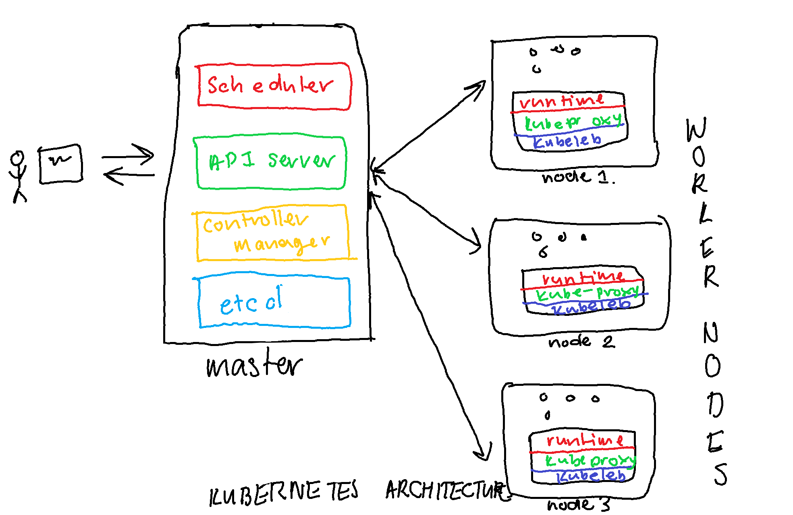

The Control Plane is the core of a Kubernetes cluster, responsible for managing and controlling the cluster's operations. It consists of several components that work together to ensure the cluster functions properly. These components can be hosted on a single master node or distributed across multiple nodes for high availability. The key Control Plane components include:

1. **Kubernetes API Server**:
    - The API Server acts as the communication hub for all components in the Control Plane.
    - It receives requests from users, other Control Plane components, and external systems, providing a unified interface to interact with the cluster.
2. **Scheduler**:
    - The Scheduler assigns worker nodes to deployable components of applications based on resource availability and constraints.
    - It ensures optimal distribution and utilization of resources across the cluster.
3. **Controller Manager**:
    - The Controller Manager performs various cluster-level functions, such as replication, managing node failures, monitoring health, and maintaining desired state.
    - It ensures that the cluster is operating as expected and takes actions to reconcile any deviations from the desired state.
4. **etcd**:
    - etcd is a distributed and reliable data store that persists the cluster configuration and state.
    - It acts as the source of truth for the cluster, holding important information such as resource allocation, component states, and configuration data.

The Control Plane components are responsible for managing and controlling the state of the cluster, but they don't directly run your applications. The actual execution of containerized applications happens on the worker nodes.

**Worker nodes** are the machines where your containerized applications run. They consist of the following key components:

1. **Container Runtime** (e.g., Docker, rkt):
    - The container runtime is responsible for running and managing containers on the worker node.
    - It provides an environment for executing and isolating applications within containers.
2. **Kubelet**:
    - The Kubelet is an agent that runs on each worker node and communicates with the API Server.
    - It manages containers on its node, ensuring they are in the desired state and responding to instructions from the Control Plane.
3. **Kubernetes Service Proxy** (kube-proxy):
    - kube-proxy is responsible for load balancing network traffic between application components within the cluster.
    - It routes and balances requests, allowing efficient communication between application components.

Together, these components on the worker nodes handle the execution, monitoring, and service provision for your containerized applications, while the Control Plane components manage and control the overall state and operations of the cluster.

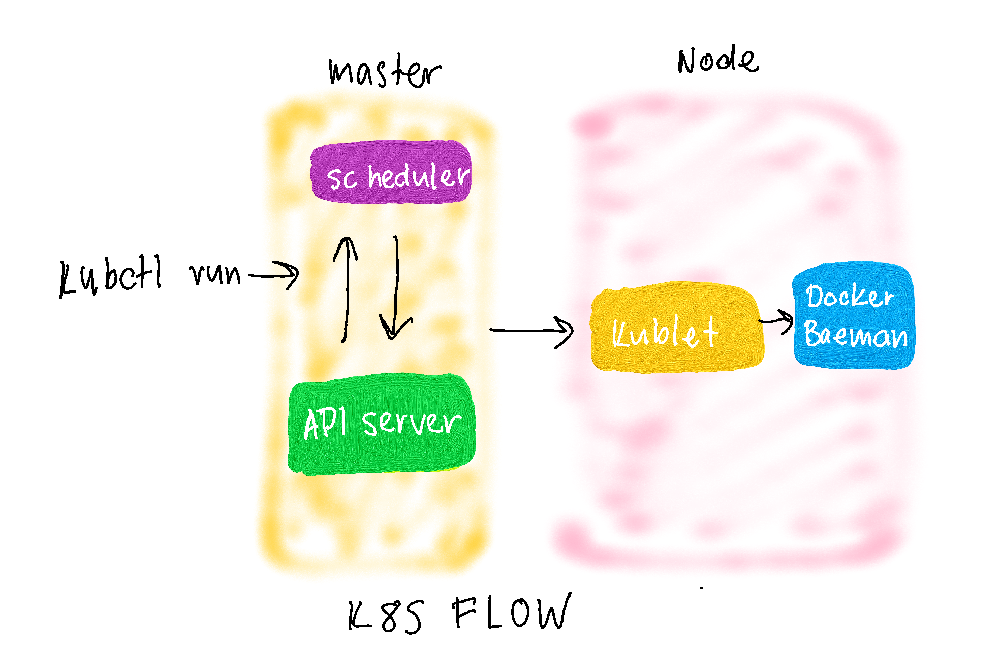

**Addons in Kubernetes** are optional components or functionalities that can be added to enhance the cluster's capabilities. Two common addons are DNS (Domain Name System) and CNI (Container Networking Interface). Here's a brief explanation of each:

1. **DNS Addon**:
    - The DNS addon in Kubernetes provides a built-in DNS service for the cluster.
    - It allows you to use custom domain names to access services within the cluster.
    - With the DNS addon, you can use service names instead of IP addresses when communicating between different services in the cluster.
  - It simplifies service discovery and enables communication between applications using human-readable names.
2. **CNI Addon**:
    - The CNI addon in Kubernetes is responsible for container networking.
    - It defines how containers within the cluster are connected to the network and how they communicate with each other.
    - CNI enables the creation of virtual networks, IP management, routing, and network policies within the cluster.
    - It provides a pluggable interface for integrating different networking solutions into the Kubernetes environment, allowing flexibility in choosing the most suitable network plugin for your cluster.

Other common addons and functionalities in Kubernetes include:

- **Ingress Controllers**: Ingress controllers handle incoming network traffic into the cluster and route it to the appropriate services based on rules and configurations. They enable external access to services within the cluster.
- **Metrics Server**: The Metrics Server collects resource utilization data, such as CPU and memory usage, from pods and nodes in the cluster. It enables monitoring and scaling based on resource metrics.
- **Dashboard**: The Kubernetes Dashboard is a web-based user interface for managing and monitoring the cluster. It provides a graphical view of resources, allows visual deployment and scaling of applications, and offers access to logs and metrics.
- **Logging and Monitoring**: Various logging and monitoring addons, such as Prometheus and Fluentd, can be integrated into Kubernetes to collect logs and metrics from pods and nodes. They help in tracking application performance, identifying issues, and gaining insights into the cluster's health.
- **Storage Provisioner**: Storage provisioners enable dynamic provisioning and management of persistent volumes for applications within the cluster. They integrate with storage providers to create and manage storage resources.

These addons and functionalities can be added to a Kubernetes cluster based on specific requirements and use cases. They extend the capabilities of the cluster, providing additional features for networking, service discovery, monitoring, logging, storage, and user interfaces.


**Kubernetes Demo**

In this demo, a user-friendly tool that allows you to set up a complete Kubernetes cluster on your desktop or laptop. You can follow installation instruction using.

Minikube office site. [https://minikube.sigs.k8s.io/docs/start/](https://minikube.sigs.k8s.io/docs/start/)

- Start minikube:
```ssh
‚ûú minikube start
üòÑ minikube v1.30.1 on Darwin 13.4.1 (arm64)
‚ú® Automatically selected the docker driver. Other choices: qemu2, ssh
üìå Using Docker Desktop driver with root privileges
üëç Starting control plane node minikube in cluster minikube
üöú Pulling base image ...
üíæ Downloading Kubernetes v1.26.3 preload ...
\> preloaded-images-k8s-v18-v1...: 330.52 MiB / 330.52 MiB 100.00% 8.12 Mi
\> gcr.io/k8s-minikube/kicbase...: 336.39 MiB / 336.39 MiB 100.00% 6.75 Mi
üî• Creating docker container (CPUs=2, Memory=8100MB) ...
üê≥ Preparing Kubernetes v1.26.3 on Docker 23.0.2 ...
‚ñ™ Generating certificates and keys ...
‚ñ™ Booting up control plane ...
‚ñ™ Configuring RBAC rules ...
üîó Configuring bridge CNI (Container Networking Interface) ...
‚ñ™ Using image gcr.io/k8s-minikube/storage-provisioner:v5
üîé Verifying Kubernetes components...
üåü Enabled addons: default-storageclass, storage-provisioner
🏄 Done! kubectl is now configured to use "minikube" cluster and "default" namespace by default
```
1. Start a local Kubernetes cluster using Minikube.
    ```sh 
    minikube start
    ```
2. Stop the currently running Minikube cluster.
    ```sh 
    minikube stop
    ```
3. Delete the Minikube cluster.
    ```sh
    minikube delete
    ```
4. Check the status of the Minikube cluster.
    ```sh
    minikube status
    ```
5. Open the Kubernetes dashboard for the Minikube cluster.
   ```sh
    minikube dashboard
   ```
6. List the available addons that can be enabled in Minikube.
   ```sh
    minikube addons list
   ```
7. Enable a specific addon in Minikube.
    ```sh
    minikube addons enable <addon-name>
    ```
8. Disable a specific addon in Minikube.
   ```sh
   minikube addons disable <addon-name>
   ```
9. Open the specified service in a web browser.
   ```sh
   minikube service <service-name>
   ```
10. Get the IP address of the Minikube cluster.
    ```sh
    minikube ip
    ```
11. SSH into the Minikube node to access its filesystem and execute commands.
    ```sh
    minikube ssh
    ```
12. Print the logs of the Minikube cluster.
    ```sh
    minikube logs
    ```
13. Set a configuration value for Minikube.
    ```sh
    minikube config set
    minikube config set memory 8192
    minikube config set cpu 4
    ```


13. View the current configuration settings for Minikube.
    ```sh
    minikube config view
    ```
14. Access minikube images and filesystem.
    ```sh
    eval $(minikube docker-env)
    minikube ssh
    ```
15. Mounting system files.
    ```sh
    minikube mount huggingface:/huggingface
    ```

You will also need kubectl, which is the command-line tool that we will use to interact with kubernetes. You can use the one found in minikube. It is possible to run it as "minikube kubectl".

**NameSpace:** It is use for isolation of application within cluster.

**Pods:** We take the source code and convert it into a docker image using Docker file. Then we build a container that can also be used by docker. If you are deploying 100s of containers on multiple nodes, you take the container and put it in a pod, the smallest unit of deployment in Kubernetes.

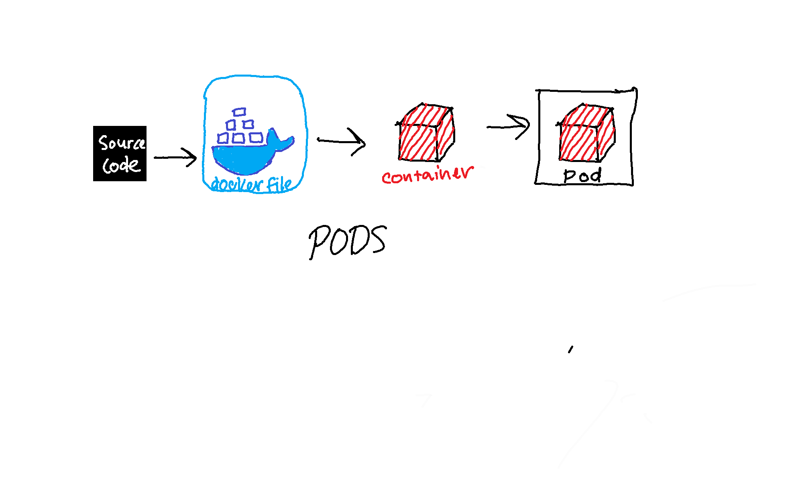

**Replication and Deployment:** When it comes to the deployment or running of an application, we need high availability. For that, we use a replica set. The replication helps to distribute the load between the pods. During deployment, the replica is the count of pods, and the replication controller takes care of scaling and availability. If add a new feature to the application and create a new version of the image, the deployment will take care of deploying the new image by using strategies like rolling update or recreate.

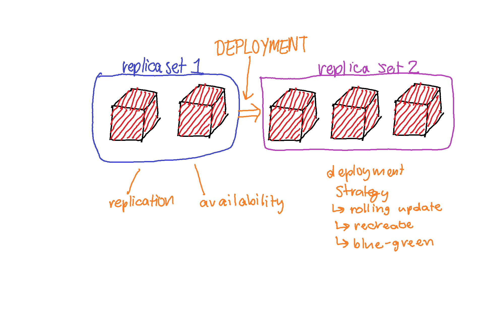 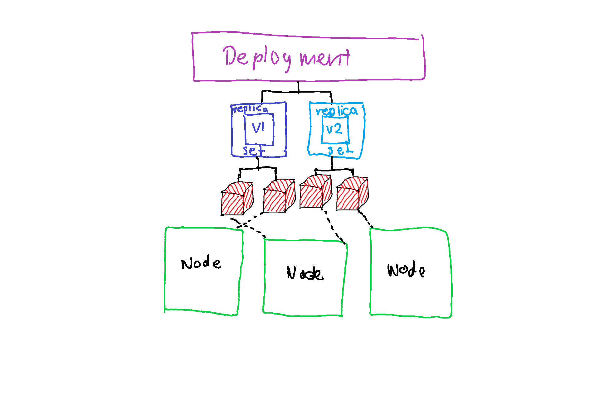

**StatefulSet:** StatefulSets are useful for managing stateful applications that require stable network identities and persistent storage, such as databases or message brokers.

**Services:** Now we got the pods, but these pods are not accessible externally and that's where the services come into the picture. Services acts as a load balancer and gives a access to the application within cluster or externally.
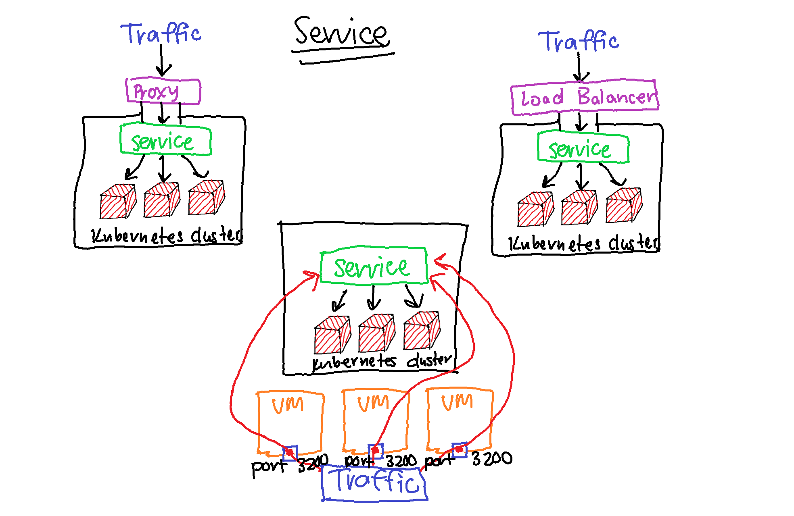

.

**Ingress** :Ingress provides load balancing, SSL termination and name-based virtual hosting.

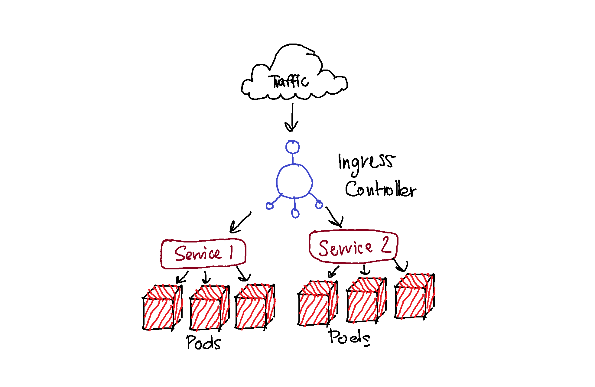

**ConfigMaps & Secrets** : It is used inject the data into a container during startup. Secrets are used for sensitive data.

**Volume:** Volumes are used for sharing data. It can be ephemeral or persistent